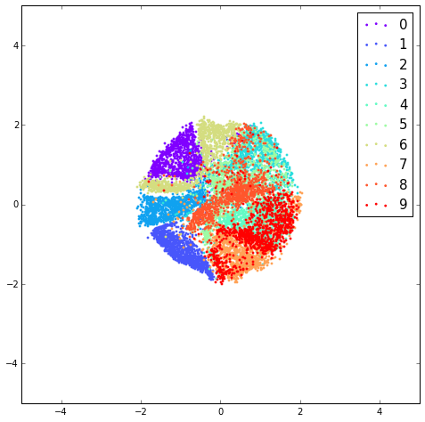
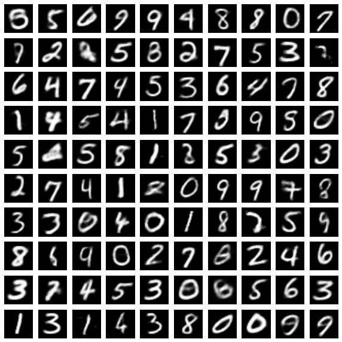

#Implementation of Adversarial Autoenocder (arXiv : http://arxiv.org/abs/1511.05644)

Python code for training Adversarial Autoenocder with Theano.

You can train example models of Adversarial Autoencoder on MNIST on the ipython notebook. 

See https://github.com/takerum/adversarial_autoencoder/blob/master/train_adv_autoenc.ipynb .

- The hidden code z of the trained adversarial autoencoder with 2-D uniform prior distribution.

 

- The input x sampled from the trained adversarial autoencoder with 8-D gaussian prior distribution.

##Required libraries:
python 2.7, theano 0.7.0

##References:
[1] Alireza Makhzani, Jonathon Shlens, Navdeep Jaitly and Ian Goodfellow. Adversarial Autoenocders. arXiv preprint (http://arxiv.org/abs/1511.05644).
